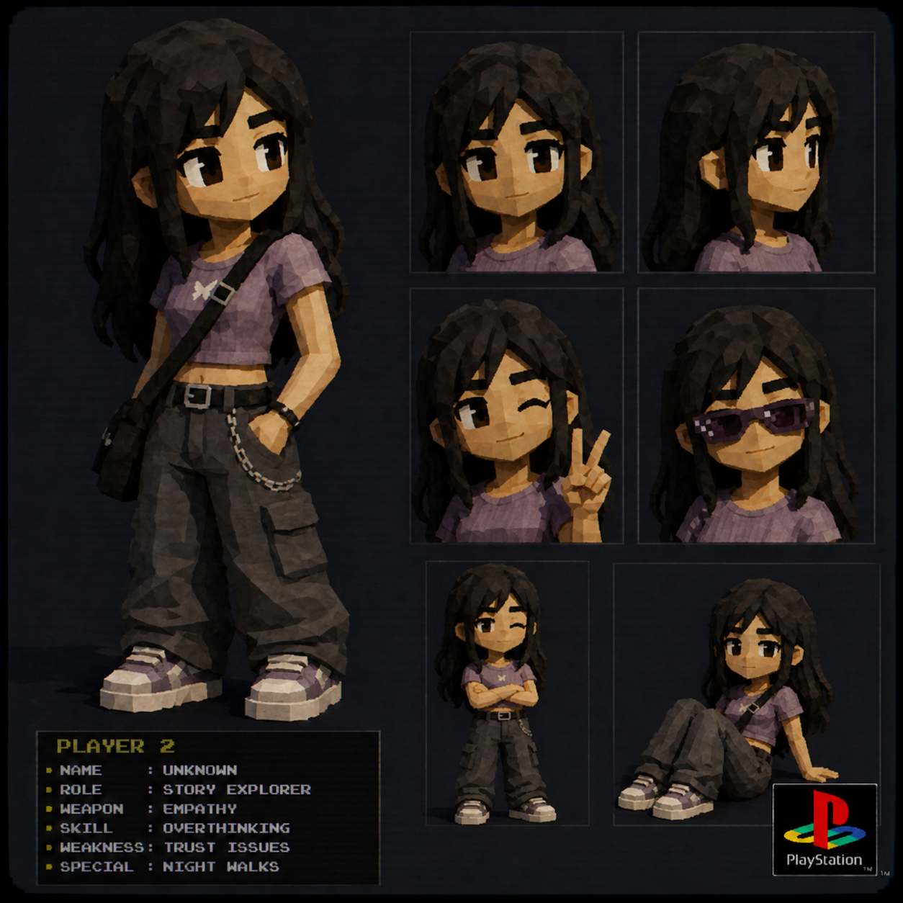
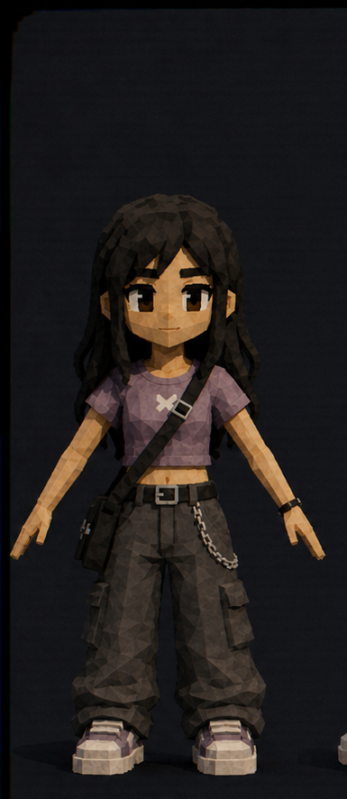
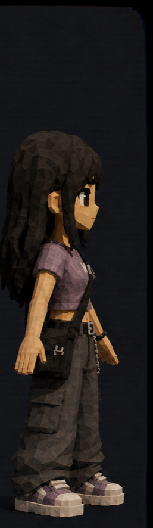
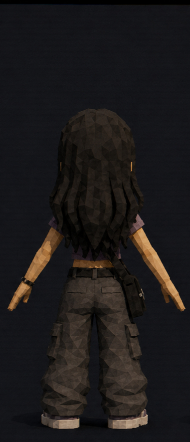
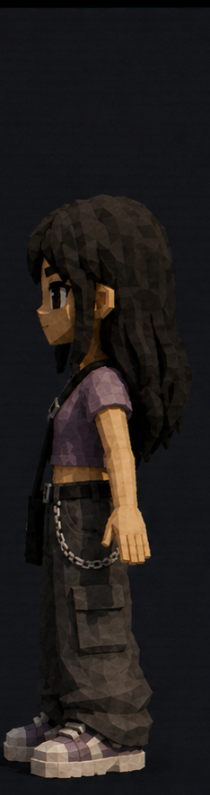

# Dia

**not your typical diva.**

Avoidant by instinct. Hopeless romantic anyway. Dia keeps her distance,
reads the room too well, and still believes the right person might understand
the quiet parts.

 
 

## Profile

Dia is guarded, not cold. She jokes when things get too honest, leaves before
the room can ask for more, and somehow still carries the softest expectations
under all that distance.

Her look is casual on purpose: purple tee, cargo pants, chain, crossbody bag,
heavy hair, and the kind of quiet confidence that does not need a speech.
She is dramatic in the private way. The face says she is fine. The outfit says
she already knew you would look.

## Dossier

| Field | Detail |
| --- | --- |
| Height | 5'5 |
| Role | Story explorer |
| Weapon | Empathy |
| Skill | Overthinking |
| Weakness | Trust issues |
| Special | Night walks |
| Energy | Diva, baddie, slays |

## Turnaround

<table>
  <tr>
    <td align="center"> <strong>Front</strong></td>
    <td align="center"> <strong>Right</strong></td>
    <td align="center"> <strong>Back</strong></td>
    <td align="center"> <strong>Left</strong></td>
  </tr>
</table>

## Notes

This repository includes both the GitHub README profile and a static site
version in [`index.html`](index.html). The site is deployed through GitHub
Pages from the files in this repo.
